# OpenManusJava

<p align="center">
  
</p>

<p align="center">
  <strong>An Intelligent Thinking System Based on Java - A Unified Single-Agent Framework</strong>
</p>

[](https://openjdk.java.net/projects/jdk/21/)
[](https://spring.io/projects/spring-boot)
[](#-architecture)
[](LICENSE)

[🚀 Quick Start](#-quick-start) •
[🎯 Features](#-features) •
[🏗️ Architecture](#-architecture) •

## 📋 Project Overview

OpenManusJava is an intelligent system built with Spring Boot and an aiframework runtime-first architecture. It uses a flattened single-agent architecture: one ReAct loop, unified tool registration, and continuous chat memory across turns.

### 🎯 Features

#### 🧠 Unified Single-Agent Reasoning
- **Single ReAct Loop**: One `UnifiedAgent` drives planning, tool use, and answer generation.
- **No Agent Handoff**: No supervisor/sub-agent string handoff or nested executor loops.
- **Session Memory Continuity**: Full message history is maintained by `ChatMemory`.

#### 💭 Unified Workflow
- **UnifiedWorkflow**: One workflow entry for both HTTP chat and streaming.
- **Unified Tool Mounting**: Browser, file, python, and reflection tools are mounted directly on the same agent.

#### 🔧 Tool Ecosystem
- **Code Execution**: Executes code and analyzes the results.
- **File Operations**: Manages files and content.
- **Web Access**: Intelligently retrieves information.

#### 🎨 User Interface
- **Modern 3-Column Workspace**:
  - **Left**: An intelligent chat panel for core human-computer interaction.
  - **Middle**: A versatile tool panel displaying structured search results, tool outputs, and files.
  - **Right**: A browser workspace with multi-tab support, address bar navigation, and dual-mode (Web/VNC) capabilities.
- **Real-time Thinking Process**: Visualizes the AI's thinking steps and logs.
- **Responsive Design**: Adapts to desktop, tablet, and mobile devices.

#### 🖼️ UI Preview


> Note: Some websites block being embedded in an iframe via security headers like `X-Frame-Options` or CSP `frame-ancestors`.
> If you see “此网站无法在此预览”, enable the **“代理”** toggle in the address bar to load the page through the backend proxy.

## 🏗️ Architecture

### Core Architecture Diagram

```mermaid
graph TD
    User --> UI[Web Interface]
    UI --> Controller[AgentController]
    
    Controller --> Service[AgentService]
    
    Service --> Workflow[UnifiedWorkflow]
    Workflow --> UA[UnifiedAgent<br/>Single ReAct Loop]
    
    subgraph "Tool Layer"
        CodeTool[Code Execution Tool]
        FileTool[File Operation Tool]
        SearchTool[Information Retrieval Tool]
    end
    
    UA --> CodeTool
    UA --> FileTool
    UA --> SearchTool
    UA --> ReflectionTool[Reflection Tool]

    UA --> FinalResult[Final Result]
    FinalResult --> WebSocket --> UI
```



### Technology Stack

| **Component** | **Technology** | **Purpose** |
|----------|-------------|---------|
| **Backend Framework** | Spring Boot 3.2.0 | Core application framework |
| **AI Integration** | aiframework runtime-first | Provider-agnostic LLM runtime abstraction and single-agent ReAct execution |
| **Frontend** | Vue.js 3 + Element Plus | Modern, responsive user interface |
| **Real-time Comms** | WebSocket + STOMP | Real-time messaging and log streaming |
| **API** | RESTful API | Service interface |
| **Documentation** | Markdown | Project documentation |

## 🚀 Quick Start

### Prerequisites

- **Java 21+**
- **Maven 3.9+**
- **OpenAI-compatible API Key** (or other supported LLM service)

### Installation

1. **Clone the project**
   ```bash
   git clone https://github.com/OpenManus/OpenManus-Java.git
   cd OpenManus-Java
   ```

2. **Configure `.env` (recommended)**
   Copy `dotenv.example` to `.env` and fill in your API settings:
   ```bash
   cp dotenv.example .env
   ```

4. **Start the application**
   ```bash
   mvn spring-boot:run
   ```

5. **Access the service**
   Open your browser and go to: http://localhost:8089

## 🧠 Long-Context Tuning (Recommended)

To keep the ReAct loop running while controlling context growth, adjust `openmanus.chat-memory` in Spring config.

- **Keep looping on tool calls**  
  Set `react-max-iterations: 0` (unlimited).  
  Optionally add `react-max-execution-seconds` and `react-repeated-tool-call-threshold` as safety guards.
- **Control model input size**  
  Use both message windows (`model-context-max-messages`, `model-context-max-total-messages`) and token budget (`model-context-max-approx-tokens`).
- **Handle large tool outputs**  
  Use lossless offload (`tool-result-offload-enabled`) + on-demand rehydrate (`tool-result-rehydrate-enabled`).

Suggested presets:

```yaml
openmanus:
  chat-memory:
    # A) High-fidelity (best continuity, higher token cost)
    model-context-max-messages: 0
    model-context-max-total-messages: 0
    model-context-max-approx-tokens: 0
    react-max-iterations: 0
    tool-result-offload-enabled: false
    tool-result-rehydrate-enabled: false
```

```yaml
openmanus:
  chat-memory:
    # B) Balanced (recommended default for long sessions)
    model-context-max-messages: 24
    model-context-max-total-messages: 48
    model-context-max-approx-tokens: 12000
    react-max-iterations: 0
    react-max-execution-seconds: 600
    react-repeated-tool-call-threshold: 8
    tool-result-offload-enabled: true
    tool-result-offload-min-chars: 12000
    tool-result-rehydrate-enabled: true
    tool-result-rehydrate-max-chars: 8000
    tool-result-rehydrate-max-per-round: 2
```

```yaml
openmanus:
  chat-memory:
    # C) Cost-saving (tight context budget)
    model-context-max-messages: 12
    model-context-max-total-messages: 20
    model-context-max-approx-tokens: 6000
    react-max-iterations: 0
    react-max-execution-seconds: 300
    react-repeated-tool-call-threshold: 6
    tool-result-offload-enabled: true
    tool-result-offload-min-chars: 8000
    tool-result-rehydrate-enabled: true
    tool-result-rehydrate-max-chars: 4000
    tool-result-rehydrate-max-per-round: 1
```

## 📊 Usage

### Unified API Endpoint

All interactions are handled through a unified streaming API, `workflow-stream`, which automatically processes and returns real-time progress.

```bash
# Example Request
curl -X POST http://localhost:8089/api/agent/workflow-stream \
  -H "Content-Type: application/json" \
  -d '{"input": "Analyze the development trend of the tourism industry during the Spring Festival."}'
```

### API Documentation

Swagger UI: http://localhost:8089/swagger-ui.html

## 📬 Contact Me

- WeChat: leochame007
- Email: liulch.cn@gmail.com


## 🙏 Acknowledgements

Thanks to the following open-source projects for their support:
- [Spring Boot](https://spring.io/projects/spring-boot)

## 📄 License

This project is licensed under the [MIT License](LICENSE).

---

<div align="center">

**🌟 If this project is helpful to you, please give it a Star!**

</div> 
