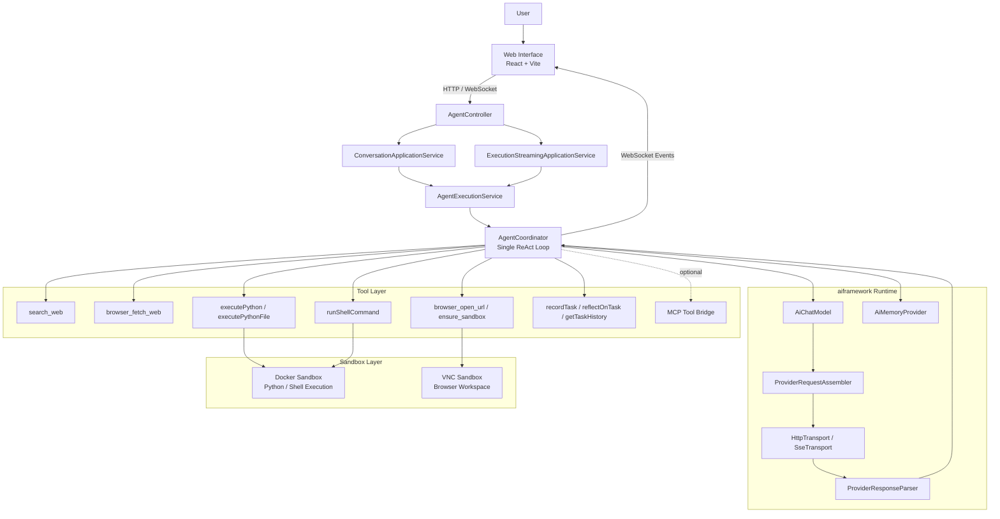

# OpenManusJava

<p align="center">
  
</p>

<p align="center">
  <strong>A Java-Powered AI Agent Framework with ReAct Reasoning</strong>
</p>

[](https://openjdk.java.net/projects/jdk/21/)
[](https://spring.io/projects/spring-boot)
[](LICENSE)
[](Dockerfile)

[🚀 Quick Start](#-quick-start) ·
[🎯 Features](#-features) ·
[🏗️ Architecture](#-architecture) ·
[🔧 Tool System](#-tool-system) ·
[⚙️ Configuration](#-configuration) ·
[📊 API Reference](#-api-reference)

## 📋 Project Overview

OpenManusJava is an intelligent agent framework built with Spring Boot, featuring a single-agent ReAct (Reason-Act) loop architecture. It provides provider-agnostic LLM integration, a pluggable annotation-driven tool system, session-scoped sandboxed code execution, and a modern 3-column web workspace with real-time execution streaming.

**Key design choices:**

- **Single ReAct Loop** — One `AgentCoordinator` drives planning, tool invocation, and answer generation in a unified loop. No supervisor/sub-agent handoff or nested executor chains.
- **Annotation-Driven Tools** — Declare tools with `@AiTool` / `@AiParam` annotations on plain Java methods; the `AiToolRegistry` auto-generates JSON Schema specifications and reflective invokers.
- **Runtime-First AI Framework** — The `aiframework` layer abstracts LLM calls behind `AiChatModel`, with pluggable `ProviderRequestAssembler` / `ProviderResponseParser` pairs for OpenAI, Anthropic, and Gemini.
- **Context Assembly** — Full chat history stays in memory, task-state cards are injected when needed, and oversized tool results are replaced with explicit stubs before the next model round.

## 🎯 Features

### 🧠 Unified Single-Agent Reasoning

- **Single ReAct Loop**: `AgentCoordinator` orchestrates Thinking → Search → Code/File → Reflection in one loop
- **No Agent Handoff**: No supervisor/sub-agent string handoff or nested executor loops
- **Session Memory Continuity**: Full message history persisted by `ChatMemory` (file or in-memory store)
- **Tool-Result Budget**: Oversized tool outputs are offloaded to sandbox files and replaced with explicit stubs before the next model round

### 🔌 Multi-Provider LLM Support

- **OpenAI** (and all OpenAI-compatible APIs)
- **Anthropic** (Claude)
- **Google Gemini**

Each provider has its own `RequestAssembler` + `ResponseParser` + `Client` triplet; swapping providers requires only a config change.

### 🔧 Tool Ecosystem

| Tool | Name | Description |
|------|------|-------------|
| **Search** | `search_web` | Web search via Serper API |
| **Web Fetch** | `browser_fetch_web` | Fetch and extract raw content from a URL |
| **Browser** | `browser_open_url`, `browser_ensure_sandbox` | Control front-end browser and VNC sandbox |
| **Python Execution** | `executePython`, `executePythonFile` | Execute Python code in a Docker sandbox |
| **Shell** | `runShellCommand` | Run shell commands inside the session sandbox |
| **Task Reflection** | `recordTask`, `reflectOnTask`, `getTaskHistory` | Record and analyze task execution history |
| **MCP** | *(dynamic)* | Optional Model Context Protocol integration for external tool discovery |

### 🎨 Web Workspace

- **Modern 3-Column Layout**:
  - **Left**: Intelligent chat panel for core interaction
  - **Middle**: Multi-purpose tool panel — structured search results, tool outputs, file previews
  - **Right**: Browser workspace with multi-tab, address bar, and dual-mode (Web/VNC) rendering
- **Real-time Execution Streaming**: WebSocket + STOMP delivers live thinking steps, tool calls, and logs
- **Web Proxy Mode**: Backend proxy for sites that block iframe embedding via `X-Frame-Options` / CSP
- **Responsive Design**: Adapts to desktop, tablet, and mobile devices

### 🖼️ UI Preview


> Some websites block iframe embedding via `X-Frame-Options` or CSP `frame-ancestors`. If you see a preview error, enable the **"Proxy"** toggle in the address bar to load the page through the backend proxy.

## 🏗️ Architecture

### Core Architecture Diagram



### Package Structure

```
com.openmanus
├── aiframework/                   # Provider-agnostic AI runtime layer
│   ├── api/                       # AiProviderClient, StreamListener interfaces
│   ├── assembler/                 # Per-provider request builders (OpenAI, Anthropic, Gemini)
│   ├── client/                    # Per-provider HTTP clients
│   ├── config/                    # AiProviderClientRegistry
│   ├── model/                     # Shared DTOs: ChatMessage, ProviderConfig, AiProviderType
│   ├── parser/                    # Per-provider response parsers
│   ├── runtime/                   # Core runtime: AiChatModel, AiMemory, AiToolSpec, MCP bridge
│   │   ├── mcp/                   # MCP client interface and stub
│   │   └── model/                 # Runtime models: AiChatRequest/Response, AiToolCall/Result
│   ├── tool/                      # @AiTool/@iParam annotations, AiToolRegistry, AiToolExecutor
│   │   └── mcp/                   # MCP tool bridge (registry bootstrap + spec adapter)
│   └── transport/                 # HttpTransport, SseTransport
│
├── agent/                         # Agent coordination and tool implementations
│   ├── base/                      # AbstractAgent, AbstractAgentExecutor (ReAct loop)
│   ├── context/                   # Context assembly and tool-result budgeting
│   │   ├── assembly/              # ContextAssembler, TaskExecutionState
│   │   └── ToolResultBudget.java  # Offloads oversized tool outputs to sandbox files
│   ├── coordination/              # AgentCoordinator (single-agent entry point)
│   ├── execution/                 # AgentExecutionService
│   └── tool/                      # Built-in tools: Browser, Python, Search, Shell, WebFetch, Reflection
│
├── domain/                        # Domain layer (ports & application services)
│   ├── model/                     # ExecutionRequest/Response, AgentExecutionEvent, error codes
│   └── service/                   # ConversationApplicationService, ExecutionStreamingApplicationService, ports
│
├── infra/                         # Infrastructure adapters
│   ├── config/                    # Spring config: OpenManusProperties, AgentArchitectureConfig, etc.
│   ├── exception/                 # Domain-specific exceptions
│   ├── execution/                 # AgentExecutionAdapter
│   ├── log/                       # Log relay: WebSocketLogAppender, LogRelayBridge
│   ├── memory/                    # ChatMemory stores: FileChatMemoryStore, InMemoryAiMemoryStore
│   ├── monitoring/                # Execution event adapters, WebSocket stream publisher
│   ├── sandbox/                   # Docker sandbox adapters, VNC sandbox client
│   └── web/                       # Controllers: AgentController, WebProxyController, etc.
│
└── sandbox/                       # Sandbox bounded context
    ├── application/               # SandboxSessionApplicationService
    ├── domain/                    # SessionSandboxInfo, SandboxRuntimePort
    ├── infra/                     # Docker adapters, lifecycle manager
    └── support/                   # SandboxPathResolver
```

### Technology Stack

| **Component** | **Technology** | **Purpose** |
|---|---|---|
| Backend Framework | Spring Boot 3.2.0 | Core application framework |
| AI Runtime | aiframework (built-in) | Provider-agnostic LLM abstraction and ReAct execution |
| LLM Providers | OpenAI / Anthropic / Gemini | Multi-provider chat completions |
| Frontend | React 18 + TypeScript + Vite | Modern SPA workspace |
| Real-time Comms | WebSocket + STOMP (SockJS) | Execution streaming and log relay |
| Code Sandbox | Docker (docker-java) | Isolated Python / Shell execution |
| Browser Sandbox | VNC (Docker) | Remote browser workspace |
| API Docs | springdoc-openapi (Swagger) | Interactive API documentation |
| Code Quality | Checkstyle + SpotBugs + OWASP + JaCoCo | Static analysis, security, coverage |
| Containerization | Docker multi-stage build | Production deployment |

## 🔧 Tool System

### Annotation-Driven Tool Registration

Tools are declared as plain Java methods annotated with `@AiTool` and `@AiParam`. The `AiToolRegistry` scans these methods at startup and auto-generates:

- **JSON Schema** parameter specifications for the LLM
- **Reflective invokers** that deserialize LLM tool-call arguments and invoke the method

```java
@AiTool(value = "Search the web for information", name = "search_web")
public String searchWeb(@AiParam("Search query keywords") String query) {
    // implementation
}
```

### Custom Tool Development

To add a new tool:

1. Create a class with `@AiTool`-annotated methods
2. Register it in `AgentArchitectureConfig` via `builder.toolFromObject(yourTool)`
3. The tool is automatically available to the ReAct loop

### MCP Integration

Enable external tool discovery via Model Context Protocol:

```yaml
openmanus:
  mcp:
    enabled: true
```

MCP tools are discovered at startup via `McpToolRegistryBootstrap` and merged into the agent's tool registry alongside built-in tools.

## ⚙️ Configuration

### Environment Variables

Configuration follows a layered priority: **explicit config** > **environment variable** > **default value**.

| Variable | Description | Default |
|---|---|---|
| `OPENMANUS_LLM_DEFAULT_LLM_API_TYPE` | LLM provider: `openai`, `anthropic`, `gemini` | `openai` |
| `OPENMANUS_LLM_DEFAULT_LLM_BASE_URL` | API base URL | `https://api.openai.com/v1` |
| `OPENMANUS_LLM_DEFAULT_LLM_API_KEY` | API key | *(required)* |
| `OPENMANUS_LLM_DEFAULT_LLM_MODEL` | Model name | *(required)* |
| `SERPER_API_KEY` | Serper search API key | *(optional)* |
| `OPENMANUS_SANDBOX_IMAGE` | Docker sandbox image | `python:3.11-slim` |
| `OPENMANUS_CHAT_MEMORY_STORE_TYPE` | Memory store: `file` or `in-memory` | `file` |
| `OPENMANUS_CHAT_MEMORY_FILE_STORE_DIR` | File memory store directory | `/tmp/openmanus/chat-memory` |
| `OPENMANUS_MCP_ENABLED` | Enable MCP tool integration | `false` |

See [`dotenv.example`](dotenv.example) for the full list.

### Long-Context Tuning

To keep the ReAct loop running without local context trimming, adjust `openmanus.chat-memory`:

- **Keep looping on tool calls** — Set `react-max-iterations: 0` (unlimited). Optionally add `react-max-execution-seconds` and `react-repeated-tool-call-threshold` as safety guards.
- **Preserve full message history** — Chat memory is no longer locally windowed, summarized, or token-trimmed before provider requests.
- **Handle large tool outputs** — Enable `tool-result-budget-enabled` so oversized outputs are written to sandbox files and replaced with explicit stubs.

**A) Full tool output inline**:

```yaml
openmanus:
  chat-memory:
    react-max-iterations: 0
    tool-result-budget-enabled: false
```

**B) Balanced** (recommended):

```yaml
openmanus:
  chat-memory:
    react-max-iterations: 0
    react-max-execution-seconds: 600
    react-repeated-tool-call-threshold: 8
    tool-result-budget-enabled: true
    tool-result-budget-min-chars: 12000
    tool-result-budget-preview-head-chars: 240
    tool-result-budget-preview-tail-chars: 160
    tool-result-budget-decay-chars: 0
```

**C) Aggressive tool-result offload**:

```yaml
openmanus:
  chat-memory:
    react-max-iterations: 0
    react-max-execution-seconds: 300
    react-repeated-tool-call-threshold: 6
    tool-result-budget-enabled: true
    tool-result-budget-min-chars: 8000
    tool-result-budget-preview-head-chars: 200
    tool-result-budget-preview-tail-chars: 120
    tool-result-budget-decay-chars: 0
```

## 🚀 Quick Start

### Prerequisites

- **Java 21+**
- **Maven 3.9+**
- **Docker** (optional, for sandboxed code execution)
- An **OpenAI-compatible API Key** (or Anthropic / Gemini key)

### Local Development

1. **Clone the project**
   ```bash
   git clone https://github.com/OpenManus/OpenManus-Java.git
   cd OpenManus-Java
   ```

2. **Configure environment**
   ```bash
   cp dotenv.example .env
   # Edit .env and fill in your API key and model settings
   ```

3. **Start with the dev script** (auto-starts frontend Vite dev server + Spring Boot)
   ```bash
   ./start-dev.sh
   ```

   Or start Spring Boot directly:
   ```bash
   mvn spring-boot:run
   ```

4. **Access the workspace**: http://localhost:8089

### Docker Deployment

```bash
# Build and start
docker compose up -d

# Check health
curl http://localhost:8089/actuator/health
```

The Docker image uses a multi-stage build: Maven build → JRE runtime with a non-root user, health checks, and configurable JVM options.

### Frontend Development

The frontend is located in `frontend/` and built with React 18 + TypeScript + Vite:

```bash
cd frontend
npm install
npm run dev          # Dev server on :5173
npm run build        # Production build → frontend/dist/
npm run test         # Vitest unit tests
```

In development mode, Spring Boot proxies frontend requests to the Vite dev server configured at `openmanus.frontend.dev-server-url`.

## 📊 API Reference

### Chat API (HTTP)

```bash
curl -X POST http://localhost:8089/api/agent/chat \
  -H "Content-Type: application/json" \
  -d '{"message": "Hello, what can you do?"}'
```

Stateful conversation with a `conversationId`:

```bash
curl -X POST "http://localhost:8089/api/agent/chat?stateful=true" \
  -H "Content-Type: application/json" \
  -d '{"message": "Analyze this data", "conversationId": "my-session-001"}'
```

### Streaming Execution API

Submit a task and receive a WebSocket topic for real-time event streaming:

```bash
curl -X POST http://localhost:8089/api/agent/workflow-stream \
  -H "Content-Type: application/json" \
  -d '{"input": "Analyze the development trend of the tourism industry during the Spring Festival."}'
```

Response:
```json
{
  "success": true,
  "sessionId": "abc-123",
  "topic": "/topic/executions/abc-123"
}
```

Subscribe to the WebSocket topic to receive real-time execution events (thinking steps, tool calls, logs).

### Session & Sandbox API

```bash
# Get session info (including VNC sandbox URL)
curl http://localhost:8089/api/agent/session/{sessionId}

# Explicitly start a session sandbox
curl -X POST http://localhost:8089/api/agent/session/{sessionId}/sandbox/start
```

### API Documentation

Swagger UI: http://localhost:8089/swagger-ui.html

## 🧪 Testing & Quality

The project uses a multi-layer testing strategy:

```bash
# Unit & integration tests (excludes e2e and live-smoke groups)
mvn test

# End-to-end tests
mvn test -Dgroups=e2e

# Live smoke tests (requires real API keys)
mvn test -Dgroups=live-smoke -Dopenmanus.liveSmoke.enabled=true

# Code coverage report (JaCoCo, target: 70%+)
mvn verify
```

**Quality gates:**
- **Checkstyle** — Google Java style (validate phase)
- **SpotBugs** — Static bug detection (medium+ threshold)
- **OWASP Dependency Check** — CVE scanning (CVSS 7+ fails build)
- **JaCoCo** — Code coverage ≥ 70% instruction coverage

## 📬 Contact

- WeChat: leochame007
- Email: liulch.cn@gmail.com

## 🙏 Acknowledgements

- [Spring Boot](https://spring.io/projects/spring-boot)
- [docker-java](https://github.com/docker-java/docker-java)
- [SpringDoc OpenAPI](https://springdoc.org)

## 📄 License

This project is licensed under the [MIT License](LICENSE).

---

<div align="center">

**If this project is helpful to you, please give it a Star!**

</div>
