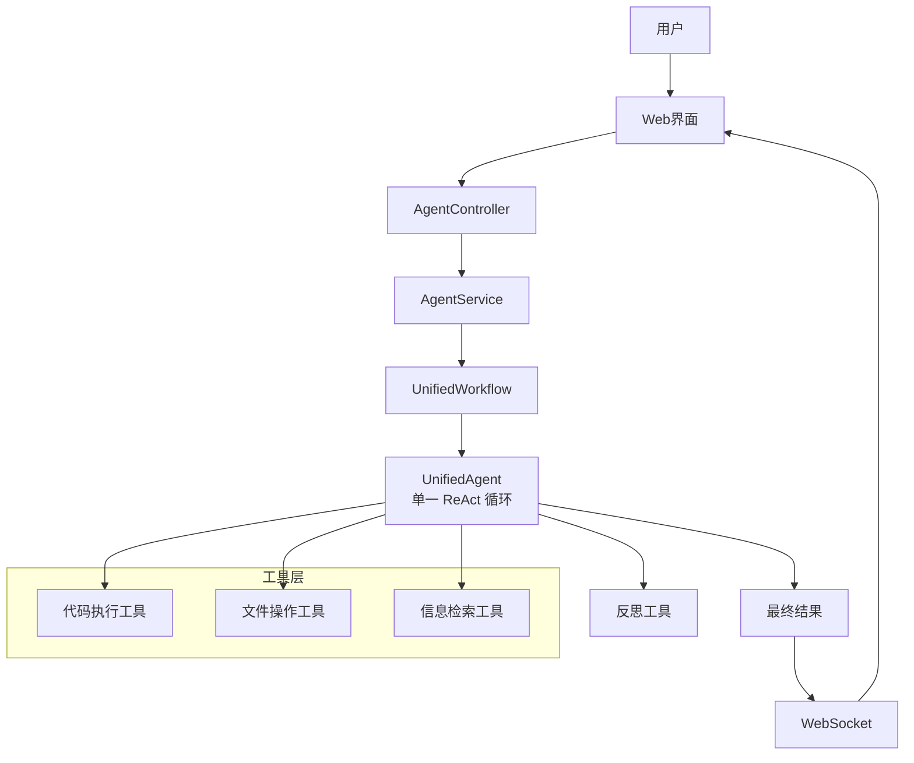

# OpenManusJava

<p align="center">
  
</p>

<p align="center">
  <strong>基于 Java 的智能思考系统 - 统一单智能体执行框架</strong>
</p>

[](https://openjdk.java.net/projects/jdk/21/)
[](https://spring.io/projects/spring-boot)
[](#-架构设计)
[](LICENSE)

[🚀 快速开始](#-快速开始) •
[🎯 功能特性](#-功能特性) •
[🏗️ 架构设计](#-架构设计) •

## 📋 项目概述

OpenManusJava 是一个基于 Spring Boot 与 aiframework runtime-first 架构的智能系统。当前采用扁平化单智能体架构：一个 ReAct 循环、统一工具注册、跨轮次连续 ChatMemory 上下文。

### 🎯 功能特性

#### 🧠 统一单智能体推理
- **单一 ReAct 循环**: 由 `UnifiedAgent` 统一驱动规划、工具调用与最终回答。
- **移除 Agent Handoff**: 不再使用 Supervisor/子 Agent 字符串中转。
- **会话连续记忆**: 使用 `ChatMemory` 保留完整消息历史。

#### 💭 统一工作流
- **UnifiedWorkflow**: HTTP 对话与流式执行共享一个入口。
- **统一工具挂载**: 浏览、文件、Python、反思工具直接挂载到同一 Agent。

#### 🔧 工具生态
- **代码执行能力**: 执行代码并分析结果
- **文件操作工具**: 管理文件和内容
- **网络访问能力**: 智能检索信息

#### 🎨 用户界面
- **现代化三栏工作台**:
  - **左**: 智能对话台，用于核心人机交互。
  - **中**: 多功能工具面板，展示结构化搜索结果、工具输出和文件。
  - **右**: 浏览器工作区，具备多标签页、地址栏导航和双模式（网页/VNC）支持。
- **实时思考过程**: 可视化展示 AI 的思考步骤和日志。
- **响应式设计**: 适配桌面、平板和移动设备。

#### 🖼️ 界面预览


> 说明：部分网站会通过 `X-Frame-Options` 或 CSP `frame-ancestors` 禁止被 iframe 嵌入，因此会出现“此网站无法在此预览”的提示。  
> 这时请在地址栏右侧开启 **“代理”** 开关，通过后端代理加载页面即可预览（仅建议用于开发/演示场景）。


## 🏗️ 架构设计

### 核心架构图



### 技术栈

| **组件** | **技术选型** | **用途** |
|----------|-------------|---------|
| **后端框架** | Spring Boot 3.2.0 | 应用核心框架 |
| **AI集成** | aiframework runtime-first | 面向多 Provider 的 LLM 运行时抽象与单智能体 ReAct 执行 |
| **前端** | Vue.js 3 + Element Plus | 现代化、响应式用户界面 |
| **实时通信** | WebSocket + STOMP | 前后端实时消息与日志流 |
| **API** | RESTful API | 服务接口 |
| **文档** | Markdown | 项目文档 |

## 🚀 快速开始

### 环境要求

- **Java 21+**
- **Maven 3.9+**
- **OpenAI 兼容 API Key** (或其他支持的LLM服务)

### 安装步骤

1. **克隆项目**
   ```bash
   git clone https://github.com/OpenManus/OpenManus-Java.git
   cd OpenManus-Java
   ```

2. **配置 `.env`（推荐）**
   将 `dotenv.example` 复制为 `.env` 并填入你的模型配置：
   ```bash
   cp dotenv.example .env
   ```

4. **启动应用**
   ```bash
   mvn spring-boot:run
   ```

5. **访问服务**
   浏览器访问: http://localhost:8089

## 🧠 长上下文参数建议（推荐）

如需“有工具调用就持续循环”并控制长上下文膨胀，建议在 Spring 配置中调整 `openmanus.chat-memory`。

- **保持工具循环不断**  
  设置 `react-max-iterations: 0`（无限轮次）。  
  可配合 `react-max-execution-seconds`、`react-repeated-tool-call-threshold` 作为安全兜底。
- **控制模型输入体积**  
  同时使用消息窗口（`model-context-max-messages`、`model-context-max-total-messages`）和近似 token 预算（`model-context-max-approx-tokens`）。
- **处理超大工具结果**  
  开启工具结果预算（`tool-result-budget-enabled`），在下一轮模型调用前把超大输出写入沙盒文件，并用可显式读取的 stub 替换。

建议三档参数：

```yaml
openmanus:
  chat-memory:
    # A) 高保真（上下文连续性最好，token 成本更高）
    model-context-max-messages: 0
    model-context-max-total-messages: 0
    model-context-max-approx-tokens: 0
    react-max-iterations: 0
    tool-result-budget-enabled: false
```

```yaml
openmanus:
  chat-memory:
    # B) 平衡档（推荐默认，适合长会话）
    model-context-max-messages: 24
    model-context-max-total-messages: 48
    model-context-max-approx-tokens: 12000
    react-max-iterations: 0
    react-max-execution-seconds: 600
    react-repeated-tool-call-threshold: 8
    tool-result-budget-enabled: true
    tool-result-budget-min-chars: 12000
    tool-result-budget-preview-head-chars: 240
    tool-result-budget-preview-tail-chars: 160
    tool-result-budget-decay-chars: 0
```

```yaml
openmanus:
  chat-memory:
    # C) 省成本档（严格控制上下文）
    model-context-max-messages: 12
    model-context-max-total-messages: 20
    model-context-max-approx-tokens: 6000
    react-max-iterations: 0
    react-max-execution-seconds: 300
    react-repeated-tool-call-threshold: 6
    tool-result-budget-enabled: true
    tool-result-budget-min-chars: 8000
    tool-result-budget-preview-head-chars: 200
    tool-result-budget-preview-tail-chars: 120
    tool-result-budget-decay-chars: 0
```

## 📊 使用方式

### 统一 API 入口

所有交互都通过统一的流式 API `workflow-stream` 进行，该 API 会自动处理并返回实时进度。

```bash
# 示例请求
curl -X POST http://localhost:8089/api/agent/workflow-stream \
  -H "Content-Type: application/json" \
  -d '{"input": "分析一下春节期间旅游行业的发展趋势"}'
```

### API 文档

Swagger UI：http://localhost:8089/swagger-ui.html

---

## 📬 联系我

- 微信：leochame007
- 邮箱：liulch.cn@gmail.com


## 🙏 致谢

感谢以下开源项目的支持：
- [Spring Boot](https://spring.io/projects/spring-boot)

## 📄 许可证

本项目采用 [MIT 许可证](LICENSE)。

---

<div align="center">

**🌟 如果这个项目对您有帮助，欢迎Star支持！**

</div>
