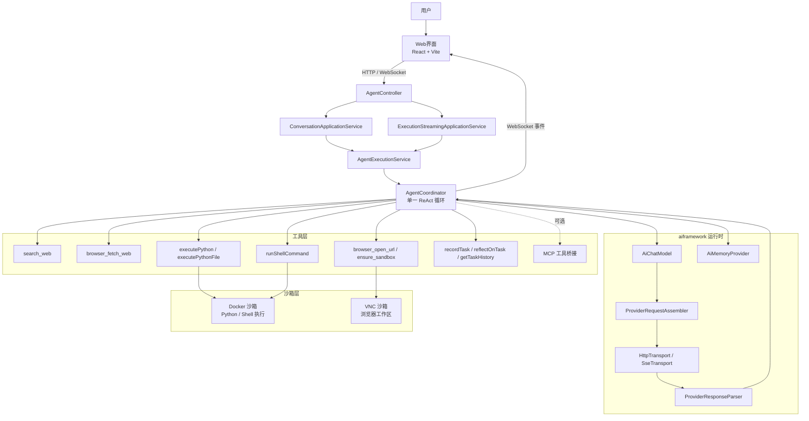

# OpenManusJava

<p align="center">
  
</p>

<p align="center">
  <strong>基于 Java 的 AI 智能体框架 — 单智能体 ReAct 推理架构</strong>
</p>

[](https://openjdk.java.net/projects/jdk/21/)
[](https://spring.io/projects/spring-boot)
[](LICENSE)
[](Dockerfile)

[快速开始](#-快速开始) ·
[功能特性](#-功能特性) ·
[架构设计](#-架构设计) ·
[工具系统](#-工具系统) ·
[配置说明](#-配置说明) ·
[API 参考](#-api-参考)

## 项目概述

OpenManusJava 是一个基于 Spring Boot 构建的智能体框架，采用单智能体 ReAct（推理-行动）循环架构。它提供多 Provider LLM 集成、注解驱动的可插拔工具系统、会话级沙箱代码执行，以及带有实时执行流推送的三栏 Web 工作台。

**核心设计决策：**

- **单一 ReAct 循环** — 由 `AgentCoordinator` 统一驱动规划、工具调用与回答生成，无需 Supervisor/子 Agent 的字符串中转或嵌套执行链。
- **注解驱动工具** — 在普通 Java 方法上使用 `@AiTool` / `@AiParam` 注解声明工具，`AiToolRegistry` 自动生成 JSON Schema 规格和反射调用器。
- **Runtime-First AI 框架** — `aiframework` 层通过 `AiChatModel` 抽象 LLM 调用，为 OpenAI、Anthropic、Gemini 提供可插拔的 `ProviderRequestAssembler` / `ProviderResponseParser` 适配对。
- **上下文组装** — 默认保留完整消息历史，按需注入任务态卡片，并在下一轮模型请求前把超大工具结果替换成可显式读取的 stub。

## 功能特性

### 统一单智能体推理

- **单一 ReAct 循环**：`AgentCoordinator` 统一编排 Thinking → Search → Code/File → Reflection
- **无 Agent Handoff**：不使用 Supervisor/子 Agent 字符串中转或嵌套执行器
- **会话连续记忆**：通过 `ChatMemory`（文件或内存存储）持久化完整消息历史
- **工具结果预算**：超大工具输出自动落盘至沙箱文件，并用可显式读取的 stub 替换，避免上下文膨胀

### 多 Provider LLM 支持

- **OpenAI**（及所有 OpenAI 兼容 API）
- **Anthropic**（Claude）
- **Google Gemini**

每个 Provider 拥有独立的 `RequestAssembler` + `ResponseParser` + `Client` 三件套，切换 Provider 只需修改配置。

### 工具生态

| 工具 | 名称 | 说明 |
|------|------|------|
| **搜索** | `search_web` | 通过 Serper API 进行网络搜索 |
| **网页抓取** | `browser_fetch_web` | 抓取目标 URL 的原始正文内容 |
| **浏览器** | `browser_open_url`, `browser_ensure_sandbox` | 控制前端浏览器与会话 VNC 沙箱 |
| **Python 执行** | `executePython`, `executePythonFile` | 在 Docker 沙箱中执行 Python 代码 |
| **Shell** | `runShellCommand` | 在会话沙箱内执行 Shell 命令 |
| **任务反思** | `recordTask`, `reflectOnTask`, `getTaskHistory` | 记录与分析任务执行历史 |
| **MCP** | *(动态)* | 可选的 Model Context Protocol 集成，发现外部工具 |

### Web 工作台

- **现代化三栏布局**：
  - **左**：智能对话台，用于核心人机交互
  - **中**：多功能工具面板 — 结构化搜索结果、工具输出、文件预览
  - **右**：浏览器工作区，多标签页、地址栏导航、双模式（网页/VNC）渲染
- **实时执行流**：WebSocket + STOMP 推送思考步骤、工具调用与日志
- **Web 代理模式**：通过后端代理加载被 `X-Frame-Options` / CSP 阻止的页面
- **响应式设计**：适配桌面、平板和移动设备

### 前端预览


> 部分网站会通过 `X-Frame-Options` 或 CSP `frame-ancestors` 禁止 iframe 嵌入。若看到预览错误，请在地址栏开启 **"代理"** 开关，通过后端代理加载页面。

## 架构设计

### 核心架构图



### 包结构

```
com.openmanus
├── aiframework/                   # 多 Provider AI 运行时抽象层
│   ├── api/                       # AiProviderClient, StreamListener 接口
│   ├── assembler/                 # 各 Provider 请求组装器（OpenAI, Anthropic, Gemini）
│   ├── client/                    # 各 Provider HTTP 客户端
│   ├── config/                    # AiProviderClientRegistry
│   ├── model/                     # 共享 DTO：ChatMessage, ProviderConfig, AiProviderType
│   ├── parser/                    # 各 Provider 响应解析器
│   ├── runtime/                   # 核心运行时：AiChatModel, AiMemory, AiToolSpec, MCP 桥接
│   │   ├── mcp/                   # MCP 客户端接口与 Stub
│   │   └── model/                 # 运行时模型：AiChatRequest/Response, AiToolCall/Result
│   ├── tool/                      # @AiTool/@iParam 注解, AiToolRegistry, AiToolExecutor
│   │   └── mcp/                   # MCP 工具桥接（注册引导 + 规格适配）
│   └── transport/                 # HttpTransport, SseTransport
│
├── agent/                         # 智能体协调与工具实现
│   ├── base/                      # AbstractAgent, AbstractAgentExecutor（ReAct 循环）
│   ├── context/                   # 上下文组装与工具结果预算
│   │   ├── assembly/              # ContextAssembler, TaskExecutionState
│   │   └── ToolResultBudget.java  # 超大工具结果落盘与 stub 替换
│   ├── coordination/              # AgentCoordinator（单智能体入口）
│   ├── execution/                 # AgentExecutionService
│   └── tool/                      # 内置工具：Browser, Python, Search, Shell, WebFetch, Reflection
│
├── domain/                        # 领域层（端口与应用服务）
│   ├── model/                     # ExecutionRequest/Response, AgentExecutionEvent, 错误码
│   └── service/                   # ConversationApplicationService, ExecutionStreamingApplicationService, 端口
│
├── infra/                         # 基础设施适配器
│   ├── config/                    # Spring 配置：OpenManusProperties, AgentArchitectureConfig 等
│   ├── exception/                 # 领域异常
│   ├── execution/                 # AgentExecutionAdapter
│   ├── log/                       # 日志中继：WebSocketLogAppender, LogRelayBridge
│   ├── memory/                    # ChatMemory 存储：FileChatMemoryStore, InMemoryAiMemoryStore
│   ├── monitoring/                # 执行事件适配器, WebSocket 流推送
│   ├── sandbox/                   # Docker 沙箱适配器, VNC 沙箱客户端
│   └── web/                       # 控制器：AgentController, WebProxyController 等
│
└── sandbox/                       # 沙箱限界上下文
    ├── application/               # SandboxSessionApplicationService
    ├── domain/                    # SessionSandboxInfo, SandboxRuntimePort
    ├── infra/                     # Docker 适配器, 生命周期管理
    └── support/                   # SandboxPathResolver
```

### 技术栈

| **组件** | **技术选型** | **用途** |
|---|---|---|
| 后端框架 | Spring Boot 3.2.0 | 应用核心框架 |
| AI 运行时 | aiframework（内置） | 多 Provider LLM 抽象与 ReAct 执行 |
| LLM Provider | OpenAI / Anthropic / Gemini | 多 Provider Chat Completions |
| 前端 | React 18 + TypeScript + Vite | 现代 SPA 工作台 |
| 实时通信 | WebSocket + STOMP (SockJS) | 执行流推送与日志中继 |
| 代码沙箱 | Docker (docker-java) | 隔离的 Python / Shell 执行环境 |
| 浏览器沙箱 | VNC (Docker) | 远程浏览器工作区 |
| API 文档 | springdoc-openapi (Swagger) | 交互式 API 文档 |
| 代码质量 | Checkstyle + SpotBugs + OWASP + JaCoCo | 静态分析、安全、覆盖率 |
| 容器化 | Docker 多阶段构建 | 生产部署 |

## 工具系统

### 注解驱动工具注册

工具通过 `@AiTool` 和 `@AiParam` 注解在普通 Java 方法上声明。`AiToolRegistry` 在启动时扫描这些方法，自动生成：

- **JSON Schema** 参数规格（供 LLM 使用）
- **反射调用器**（反序列化 LLM 工具调用参数并执行方法）

```java
@AiTool(value = "搜索网络内容", name = "search_web")
public String searchWeb(@AiParam("搜索关键词") String query) {
    // 实现
}
```

### 自定义工具开发

添加新工具只需三步：

1. 创建带有 `@AiTool` 注解方法的类
2. 在 `AgentArchitectureConfig` 中通过 `builder.toolFromObject(yourTool)` 注册
3. 工具自动对 ReAct 循环可用

### MCP 集成

通过 Model Context Protocol 启用外部工具发现：

```yaml
openmanus:
  mcp:
    enabled: true
```

MCP 工具在启动时通过 `McpToolRegistryBootstrap` 发现，并与内置工具合并注册到智能体工具链。

## ⚙️ 配置说明

### 环境变量

配置优先级：**显式配置** > **环境变量** > **默认值**。

| 变量 | 说明 | 默认值 |
|---|---|---|
| `OPENMANUS_LLM_DEFAULT_LLM_API_TYPE` | LLM Provider：`openai`、`anthropic`、`gemini` | `openai` |
| `OPENMANUS_LLM_DEFAULT_LLM_BASE_URL` | API 基础 URL | `https://api.openai.com/v1` |
| `OPENMANUS_LLM_DEFAULT_LLM_API_KEY` | API 密钥 | *(必填)* |
| `OPENMANUS_LLM_DEFAULT_LLM_MODEL` | 模型名称 | *(必填)* |
| `SERPER_API_KEY` | Serper 搜索 API Key | *(可选)* |
| `OPENMANUS_SANDBOX_IMAGE` | Docker 沙箱镜像 | `python:3.11-slim` |
| `OPENMANUS_CHAT_MEMORY_STORE_TYPE` | 记忆存储：`file` 或 `in-memory` | `file` |
| `OPENMANUS_CHAT_MEMORY_FILE_STORE_DIR` | 文件存储目录 | `/tmp/openmanus/chat-memory` |
| `OPENMANUS_MCP_ENABLED` | 启用 MCP 工具集成 | `false` |

完整变量列表见 [`dotenv.example`](dotenv.example)。

### 长上下文参数建议

如需“有工具调用就持续循环”且不做本地上下文裁剪，调整 `openmanus.chat-memory`：

- **保持工具循环不断** — 设置 `react-max-iterations: 0`（无限轮次），可配合 `react-max-execution-seconds` 和 `react-repeated-tool-call-threshold` 作为安全兜底。
- **保留完整消息历史** — 当前不再对上下文消息做本地窗口裁剪、摘要压缩或 token 预算截断。
- **处理超大工具结果** — 开启 `tool-result-budget-enabled`，超大输出自动落盘至沙箱文件，并用可显式读取的 stub 替换。

**A) 工具结果不落盘**：

```yaml
openmanus:
  chat-memory:
    react-max-iterations: 0
    tool-result-budget-enabled: false
```

**B) 平衡档**（推荐）：

```yaml
openmanus:
  chat-memory:
    react-max-iterations: 0
    react-max-execution-seconds: 600
    react-repeated-tool-call-threshold: 8
    tool-result-budget-enabled: true
    tool-result-budget-min-chars: 12000
    tool-result-budget-preview-head-chars: 240
    tool-result-budget-preview-tail-chars: 160
    tool-result-budget-decay-chars: 0
```

**C) 激进工具结果落盘**：

```yaml
openmanus:
  chat-memory:
    react-max-iterations: 0
    react-max-execution-seconds: 300
    react-repeated-tool-call-threshold: 6
    tool-result-budget-enabled: true
    tool-result-budget-min-chars: 8000
    tool-result-budget-preview-head-chars: 200
    tool-result-budget-preview-tail-chars: 120
    tool-result-budget-decay-chars: 0
```

## 快速开始

### 环境要求

- **Java 21+**
- **Maven 3.9+**
- **Docker**（可选，用于沙箱代码执行）
- **OpenAI 兼容 API Key**（或 Anthropic / Gemini Key）

### 本地开发

1. **克隆项目**
   ```bash
   git clone https://github.com/OpenManus/OpenManus-Java.git
   cd OpenManus-Java
   ```

2. **配置环境变量**
   ```bash
   cp dotenv.example .env
   # 编辑 .env，填入 API Key 和模型配置
   ```

3. **使用开发脚本启动**（自动启动前端 Vite Dev Server + Spring Boot）
   ```bash
   ./start-dev.sh
   ```

   或直接启动 Spring Boot：
   ```bash
   mvn spring-boot:run
   ```

4. **访问工作台**：http://localhost:8089

### Docker 部署

```bash
# 构建并启动
docker compose up -d

# 健康检查
curl http://localhost:8089/actuator/health
```

Docker 镜像采用多阶段构建：Maven 构建 → JRE 运行时（非 root 用户、健康检查、可配置 JVM 参数）。

### 前端开发

前端位于 `frontend/` 目录，使用 React 18 + TypeScript + Vite 构建：

```bash
cd frontend
npm install
npm run dev          # 开发服务器 :5173
npm run build        # 生产构建 → frontend/dist/
npm run test         # Vitest 单元测试
```

开发模式下，Spring Boot 将前端请求代理到 `openmanus.frontend.dev-server-url` 配置的 Vite Dev Server。

## API 参考

### 对话 API（HTTP）

```bash
curl -X POST http://localhost:8089/api/agent/chat \
  -H "Content-Type: application/json" \
  -d '{"message": "你好，你能做什么？"}'
```

带 `conversationId` 的有状态对话：

```bash
curl -X POST "http://localhost:8089/api/agent/chat?stateful=true" \
  -H "Content-Type: application/json" \
  -d '{"message": "分析这些数据", "conversationId": "my-session-001"}'
```

### 流式执行 API

提交任务并获取 WebSocket Topic，用于实时事件流：

```bash
curl -X POST http://localhost:8089/api/agent/workflow-stream \
  -H "Content-Type: application/json" \
  -d '{"input": "分析春节期间旅游行业的发展趋势"}'
```

响应：
```json
{
  "success": true,
  "sessionId": "abc-123",
  "topic": "/topic/executions/abc-123"
}
```

订阅 WebSocket Topic 接收实时执行事件（思考步骤、工具调用、日志）。

### 会话与沙箱 API

```bash
# 查询会话信息（包括 VNC 沙箱 URL）
curl http://localhost:8089/api/agent/session/{sessionId}

# 显式启动会话沙箱
curl -X POST http://localhost:8089/api/agent/session/{sessionId}/sandbox/start
```

### API 文档

Swagger UI：http://localhost:8089/swagger-ui.html

## 🧪 测试与评测

先记这一条：`./scripts/run-eval.sh bench`

| 目标 | 命令 | 适用场景 |
|---|---|---|
| 本地评测基线 | `./scripts/run-eval.sh bench` | 毕设演示、日常回归 |
| 端到端验证 | `./scripts/run-eval.sh e2e` | 验证 API / WebSocket 流程 |
| 真实模型联调 | `./scripts/run-eval.sh live` | 验证 Provider、TLS、凭证 |
| 代码覆盖率 | `./scripts/mvnw-local.sh -q verify` | JaCoCo 报告 |

更多 benchmark 设计说明见 [`docs/BENCHMARKS.md`](docs/BENCHMARKS.md)。

**质量门禁：**
- **Checkstyle** — Google Java 代码风格（validate 阶段）
- **SpotBugs** — 静态 Bug 检测（medium+ 阈值）
- **OWASP Dependency Check** — CVE 漏洞扫描（CVSS 7+ 构建失败）
- **JaCoCo** — 代码覆盖率 ≥ 70% 指令覆盖

## 联系我

- 微信：leochame007
- 邮箱：liulch.cn@gmail.com

## 致谢

- [Spring Boot](https://spring.io/projects/spring-boot)
- [docker-java](https://github.com/docker-java/docker-java)
- [SpringDoc OpenAPI](https://springdoc.org)

## 许可证

本项目采用 [MIT 许可证](LICENSE)。

---

<div align="center">

**如果这个项目对您有帮助，欢迎 Star 支持！**

</div>
