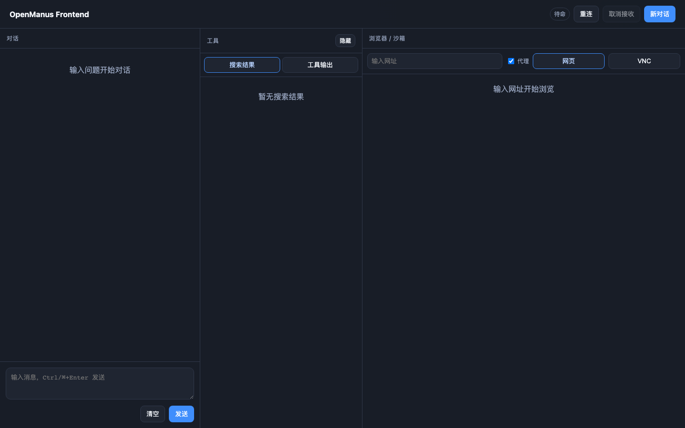

# OpenManus Frontend (React + Vite)

## Preview



## Quick Start

```bash
cd frontend
npm install
npm run dev
```

Default backend URL: `http://localhost:8089`
Internal Vite dev URL: `http://localhost:5173`

## Backend Dependency

Starting the Spring Boot web application also starts this Vite frontend.

Vite proxy is preconfigured:
- `/api` -> `http://localhost:8089`
- `/ws` -> `http://localhost:8089`

## Stream Protocol (WebSocket)

1. POST `/api/agent/workflow-stream` with `{ "input": "..." }`
2. Read `sessionId` and `topic` from response
3. Connect SockJS/STOMP endpoint `/ws`
4. Subscribe:
   - `${topic}` (execution events)
   - `${topic}/logs` (frontend logs)
   - `${topic}/result` (final result)

## Scripts

- `npm run dev`
- `npm run build`
- `npm run test`
